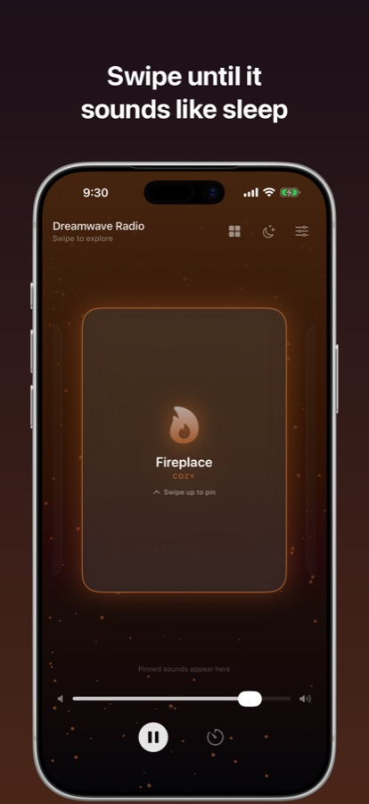
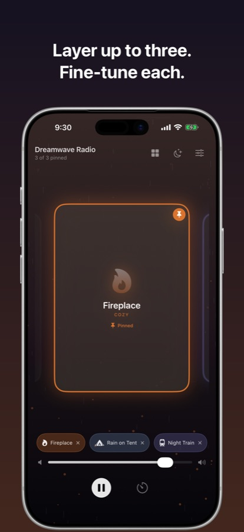
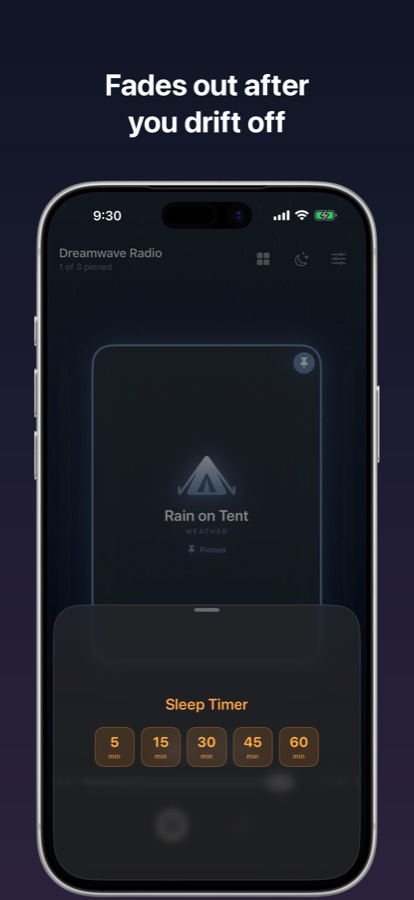
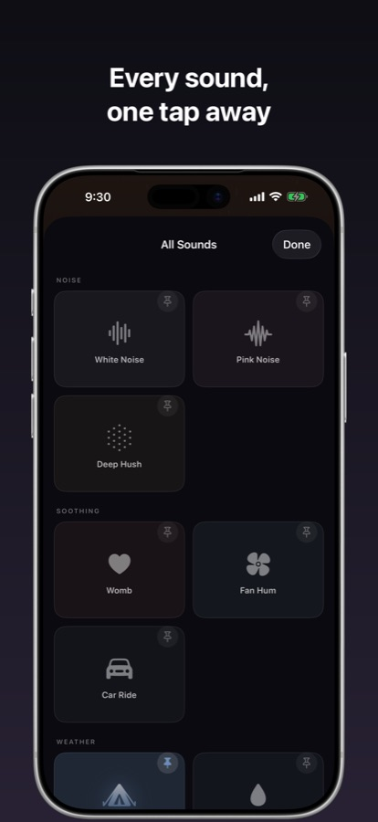
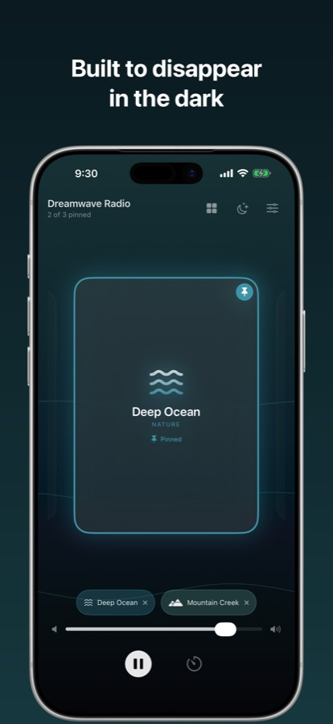
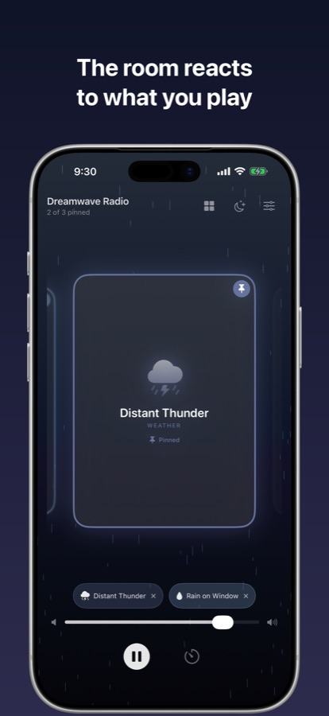

🇺🇸 [English](README.md) | 🇩🇪 **Deutsch**

# Dreamwave Radio - Einschlafgeräusche, weißes Rauschen & Ambient-Mixer für iPhone & iPad

**Mische Umgebungsgeräusche zu deinem eigenen Klangbild und schlafe mit dem Timer ein. Kein Konto, kein Tracking, nichts verlässt dein Gerät.**

Die meisten Schlaf-Apps geben dir eine feste Playlist und eine monatliche Rechnung. Dreamwave Radio gibt dir ein Mischpult. Leg Regen über ein Kaminfeuer, setz einen Ventilator unter einen Nachtzug und regle jede Ebene einzeln, bis es nach dem Raum klingt, in dem du wirklich einschlafen willst.

---

## ✨ Was die App anders macht

### 🎚️ Bis zu drei Klänge gleichzeitig mischen

Keine Playlist, sondern eine Mischung. Fixiere bis zu drei Sender und regle jede Lautstärke einzeln. Regen aufs Zelt über fernem Gewitter. Ein Ventilator unter einer Autofahrt. Genau darum geht es.

### 🔊 Sechs Klänge werden synthetisiert, nicht abgespielt

Weißes Rauschen, Rosa Rauschen und Tiefe Stille entstehen live auf deinem Gerät. Ebenso Mutterleib, Ventilator und Autofahrt. Weil sie berechnet und nicht von einer Datei abgespielt werden, entwickeln sie nie den hörbaren Schleifenpunkt, an dem man die meisten Rausch-Apps um drei Uhr nachts erkennt.

Die übrigen neun sind aufgenommene Loops, die mit der App ausgeliefert werden.

### ⏱️ Ein Timer, der ausblendet

5, 15, 30, 45 oder 60 Minuten, mit einem Knopf für „15 Minuten mehr", falls es noch nicht ganz reicht. Die Mischung blendet aus, statt abrupt zu stoppen - so weckt dich der Timer nicht beim Verschwinden.

### 🌙 Nachtmodus

Dimmt die gesamte Oberfläche für ein dunkles Schlafzimmer, damit ein Blick auf den Timer nicht wie eine Taschenlampe ins Gesicht wirkt.

### 📱 Zu Hause auf iPhone und iPad

Eine App, für beide gebaut. Auf dem iPhone bleibt alles im Dunkeln einhändig erreichbar. Auf dem iPad öffnet sich die Klangbibliothek bildschirmfüllend, alle fünfzehn Sender auf einen Blick.

### 🔒 Kein Konto, kein Netz, keine Daten

Es gibt keine Registrierung, keine Analyse und keinen Server. Die App erhebt keine Daten, weil sie nirgendwohin senden könnte. Siehe [Datenschutzerklärung](privacy_policy.md).

---

## 📸 Screenshots

| | | |
|:--:|:--:|:--:|
|  |  |  |
|  |  |  |

---

## 🎵 Die Klangbibliothek

15 Sender in fünf Kategorien.

**Rauschen** - Weißes Rauschen · Rosa Rauschen · Tiefe Stille
**Beruhigend** - Mutterleib · Ventilator · Autofahrt
**Wetter** - Regen aufs Zelt · Regen am Fenster · Fernes Gewitter
**Natur** - Tiefes Meer · Waldnacht · Sommerstraße · Bergbach
**Gemütlich** - Kaminfeuer · Nachtzug

---

## 📱 Voraussetzungen

- iOS 17.0 oder neuer
- iPhone und iPad

---

## 🌍 Sprachen

Englisch und Deutsch.

---

## 💬 Rückmeldungen

Dieses Repository ist die Anlaufstelle für Support. Es enthält keinen Quellcode - es gibt es für Fehlermeldungen, Dokumentation und die Datenschutzerklärung.

- 🐛 [Fehler melden](https://github.com/aloth/dreamwave-radio/issues/new?template=bug-report.md) - Abstürze, Klänge die nicht abspielen, alles was nicht wie dokumentiert funktioniert
- 💡 [Funktion vorschlagen](https://github.com/aloth/dreamwave-radio/issues/new?template=feature_request.md) - ein Klang der dir fehlt, eine Einstellung die du vermisst
- 🔎 [Bestehende Meldungen ansehen](https://github.com/aloth/dreamwave-radio/issues) - vielleicht hat es jemand schon gemeldet
- 📧 [support+dreamwave@alexloth.com](mailto:support+dreamwave@alexloth.com?subject=Dreamwave%20Radio) - für alles, was du lieber nicht öffentlich schreiben möchtest

---

## 📄 Rechtliches

- [Datenschutzerklärung](privacy_policy.md)
- [Nutzungsbedingungen (Apple Standard-EULA)](https://www.apple.com/legal/internet-services/itunes/dev/stdeula/)

---

Entwickelt von [Alexander Loth](https://github.com/aloth) · [alexloth.com](https://alexloth.com) · [X](https://x.com/xlth)

*Für ruhigere Nächte.* © 2026 Alexander Loth
