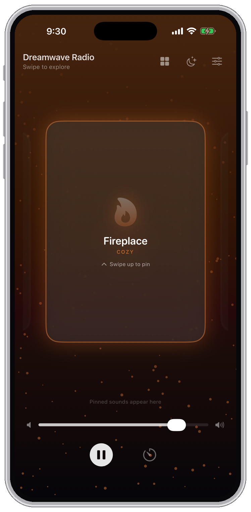
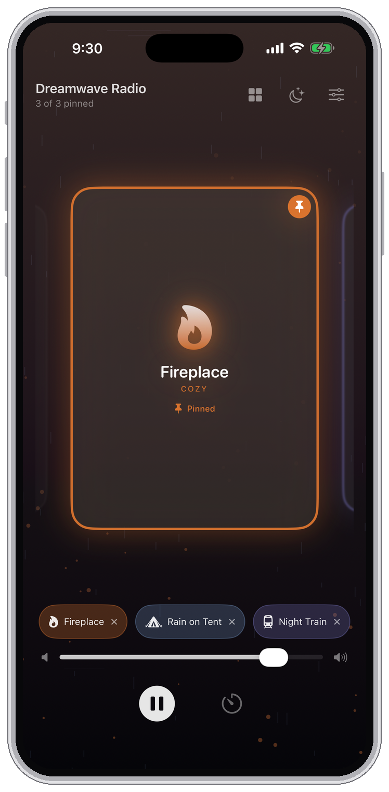
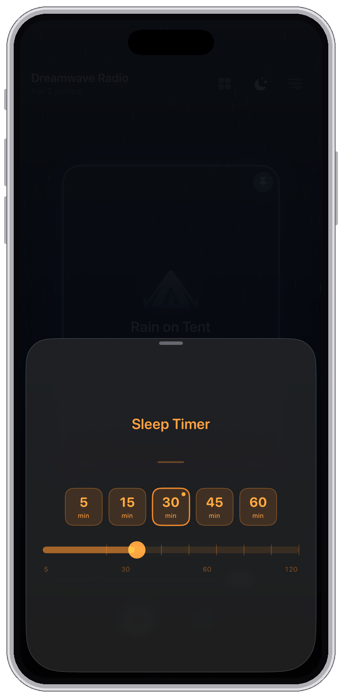
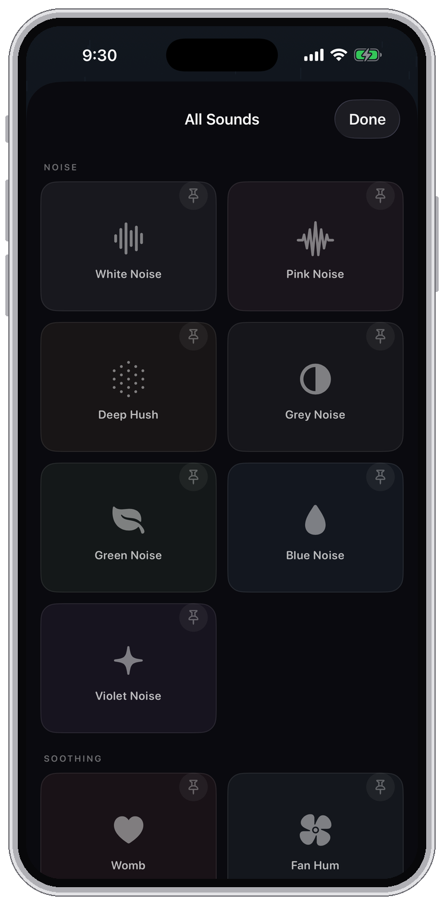
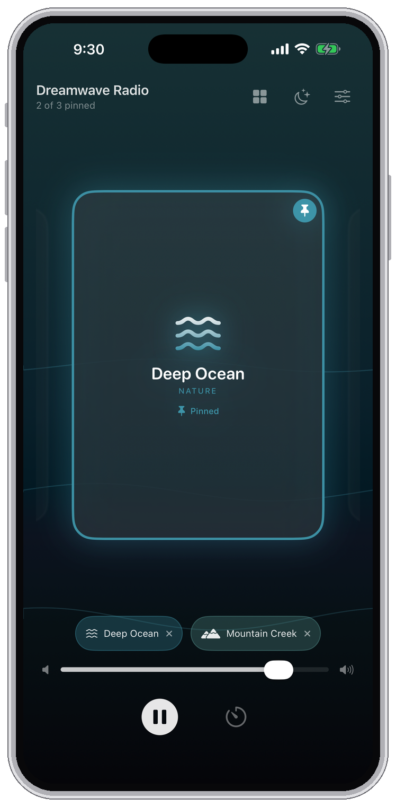
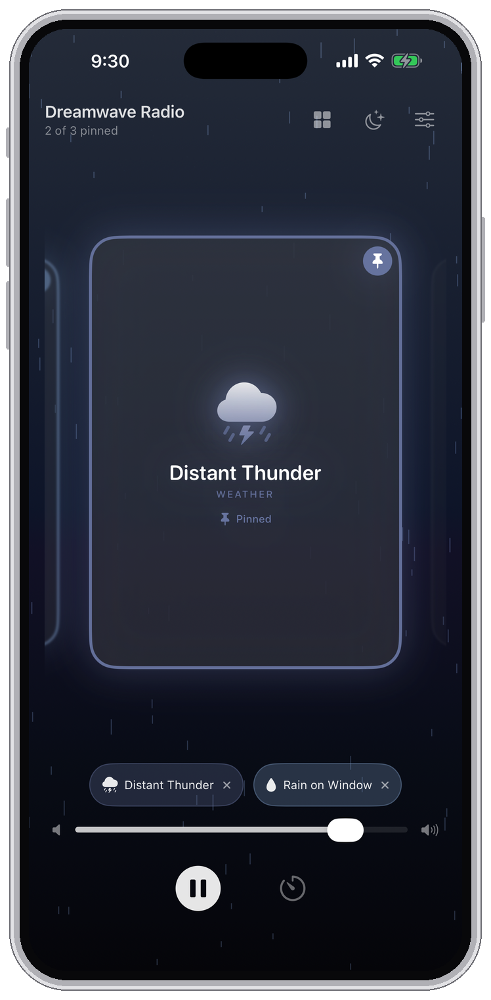

🇺🇸 [English](README.md) | 🇩🇪 [Deutsch](README_de.md) | 🇪🇸 [Español](README_es.md) | 🇫🇷 [Français](README_fr.md) | 🇮🇹 [Italiano](README_it.md) | 🇯🇵 [日本語](README_ja.md) | 🇳🇱 [Nederlands](README_nl.md) | 🇧🇷 [Português](README_pt-BR.md) | 🇨🇳 **中文**

# Dreamwave Radio - 适用于 iPhone 和 iPad 的助眠声音、白噪声与环境混音器

**把环境声音混成你自己的一份，在定时器里入睡。没有账户，没有追踪，什么都不离开你的设备。**

**一次性 4.99 美元。** 没有订阅，没有广告，没有应用内购买。

大多数助眠应用给你一份固定的播放列表和一张每月的账单。Dreamwave Radio 给你一台调音台。把雨声叠在壁炉上，把风扇垫在夜行列车下面，分别调节每一层的音量，直到它听起来像你真正想在里面入睡的那个房间。

---

## ✨ 与众不同之处

### 🎚️ 最多同时混合三种声音

这不是播放列表，而是一份混音。固定最多三个声音，各自调节音量。远雷之上是打在帐篷上的雨。壁炉之下是夜风。组合本身才是重点。

### 🔊 永不重复的声音

大多数助眠应用循环播放一段录音，到了凌晨三点，你会听见那道接缝。夜风在三个永不重合的周期上吹动。远处的雨让每一滴都落在新的位置。猫咪呼噜会像真正的猫那样停顿。应用是一边播放一边生成这些声音的，所以没有接缝可听。

录制的声音也经过处理，衔接处没有痕迹，让漫长的夜晚成为一段连续的声音，而不是一段不断重新开始的音轨。

### 🗣️ 开口就行

「用 Dreamwave Radio 播放雨声。」「设一个睡眠定时器。」「再给我十五分钟。」Siri 会播放声音、把声音加入混音、或者延长定时器，而应用始终不必出现在屏幕上。Siri 能做的一切也都是快捷指令，声音因此可以成为你睡前流程的一部分。

### ⏱️ 会淡出的定时器

既有常用夜晚的预设，也可以把刻度拖到 1 到 120 分钟之间的任意时长。混音是渐渐淡出而不是戛然而止，所以定时器离开时从不会把你吵醒。运行期间，它会显示在锁定屏幕和灵动岛上，一眼就能看到还剩多久。

### 🌙 夜间模式

把整个界面调暗，适合漆黑的卧室，所以查看定时器不必拿手电筒照自己的脸。

### 📱 在 iPhone 和 iPad 上都自在

一个应用，为两者打造。在 iPhone 上，黑暗中也能单手够到。在 iPad 上，声音库全屏打开，整个库一次呈现在你面前。

### 🔒 没有账户、没有网络、没有数据

没有注册，没有分析，没有服务器。应用不收集数据，因为它无处可发。请参阅[隐私政策](privacy_policy.md)。

---

## 📸 截图

| | | |
|:--:|:--:|:--:|
|  |  |  |
|  |  |  |

---

## 🎵 声音库

五个类别共 27 个声音，其中大多数在播放时生成，因此永不重复。

**噪声** - 白噪声 · 粉红噪声 · 深邃静谧 · 灰噪声 · 绿噪声 · 蓝噪声 · 紫噪声
**舒缓** - 母体 · 风扇声 · 车行途中 · 缓缓漂流 · 猫咪呼噜 · 客舱 · 嘘声
**天气** - 雨打帐篷 · 雨打窗棂 · 远处雷声 · 夜风 · 远处的雨
**自然** - 深海 · 林间夜色 · 夏日街巷 · 山间溪流
**惬意** - 壁炉 · 夜行列车 · 黑胶噼啪 · 淋浴

---

## 📱 系统要求

- iOS 17.0 或更高版本
- iPhone 和 iPad

---

## 🌍 语言

英语、德语、西班牙语、法语、意大利语、日语、荷兰语、巴西葡萄牙语和简体中文。声音名称也已翻译。

---

## 💬 反馈

这个仓库是提供支持的地方。它不含源代码：用于问题反馈、文档和隐私政策。

- [报告缺陷](https://github.com/aloth/dreamwave-radio/issues/new?template=bug-report.md) - 崩溃、无法播放的声音、任何与文档不符的情况
- [建议功能](https://github.com/aloth/dreamwave-radio/issues/new?template=feature_request.md) - 你想要的声音、你缺少的设置
- [浏览现有问题](https://github.com/aloth/dreamwave-radio/issues) - 也许有人已经报告过
- [support@alexloth.com](mailto:support@alexloth.com?subject=Dreamwave%20Radio) - 任何你不愿公开的内容

---

## 📄 法律

- [隐私政策](privacy_policy.md)
- [使用条款（Apple 标准 EULA）](https://www.apple.com/legal/internet-services/itunes/dev/stdeula/)

---

由 [Alexander Loth](https://github.com/aloth) 打造 · [alexloth.com](https://alexloth.com) · [X](https://x.com/xlth)

*为更安静的夜晚。* © 2026 Alexander Loth
